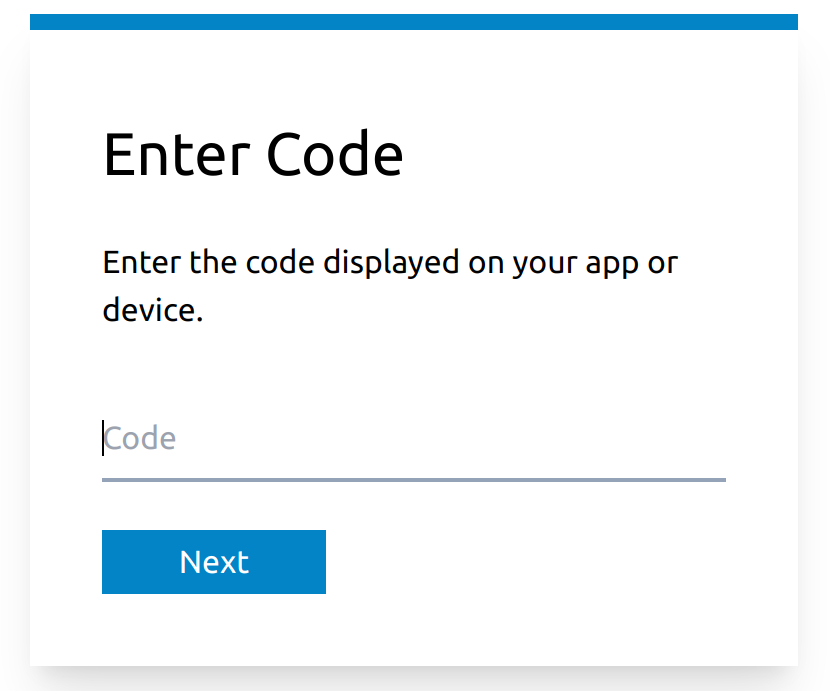

# Azure AD B2C Device Code Flow Service

This is a web service that can be used to implement a [device code
flow](https://docs.microsoft.com/en-us/azure/active-directory/develop/v2-oauth2-device-code)
for [Azure Active Directory
B2C](https://docs.microsoft.com/en-us/azure/active-directory-b2c/overview)
authentication. This project exists because device code flows are not supported
in Azure AD B2C today. So if you wanted to use Azure AD B2C in scenarios where
launching a browser is not feasible then you're stuck using the [authorization
code grant
flow](https://docs.microsoft.com/en-us/azure/active-directory-b2c/authorization-code-flow)
which means that you will have to ship a client secret along with your
application which would be a bad idea unless your app is designed to run only in
a server environments that you control.

This service implements the device code flow by using the authorization code
grant flow in the background. So your client app can run without needing to ship
secrets. It is likely however, that it is only a matter of time before Azure AD
B2C itself directly supports device code flows at which point you should just
use that.
