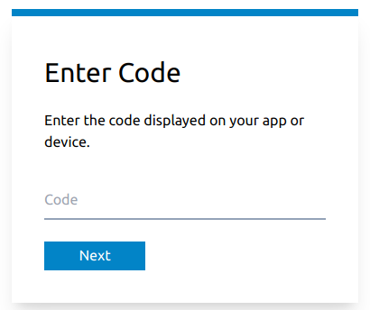
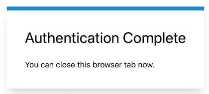

# Azure AD B2C Device Code Flow Service

This is a web service that can be used to implement a [device code
flow](https://docs.microsoft.com/en-us/azure/active-directory/develop/v2-oauth2-device-code)
for [Azure Active Directory
B2C](https://docs.microsoft.com/en-us/azure/active-directory-b2c/overview)
authentication. This project exists because device code flows are not supported
in Azure AD B2C today. So if you wanted to use Azure AD B2C in scenarios where
launching a browser is not feasible then you're stuck using the [authorization
code grant
flow](https://docs.microsoft.com/en-us/azure/active-directory-b2c/authorization-code-flow)
which means that you will have to ship a client secret along with your
application which would be a bad idea unless your app is designed to run only in
server environments that you control.

This service implements the device code flow by using the authorization code
grant flow in the background. So your client app can be distributed without
needing to ship secrets. It is likely however, that it is only a matter of time
before Azure AD B2C itself directly supports device code flows at which point
you should just use that.

## Building

Here are the steps for building the code:

1. Install Rust from [https://rustup.rs](https://rustup.rs)
2. Clone this repo
3. Run `cargo build` from a terminal

## Running

The service requires a slew of environment variables to be set before it can
run. The repo includes a `Dockerfile` and a `docker-compose.yml` file that you
can look at to see what a typical deployment might look like. Here's some
documentation for what the environment variables mean.

| Environment Variable             | Description                                                                                                                                                                                                                                                          |
| -------------------------------- | -------------------------------------------------------------------------------------------------------------------------------------------------------------------------------------------------------------------------------------------------------------------- |
| AADB2C_DEVICE_CODE_CLIENT_ID     | Azure AD B2C app's client ID from the Azure Portal                                                                                                                                                                                                                   |
| AADB2C_DEVICE_CODE_CLIENT_SECRET | Generate a client secret for your Azure AD B2C app and put that here                                                                                                                                                                                                 |
| AADB2C_DEVICE_CODE_TENANT_NAME   | Azure AD B2C tenant name                                                                                                                                                                                                                                             |
| AADB2C_DEVICE_CODE_POLICY_NAME   | Name of the B2C user flow you created for sign-in or sign-up or any other flow                                                                                                                                                                                       |
| AADB2C_DEVICE_CODE_SITE_URL      | URL where this service is running. When running locally, this would be `http://localhost:32468`. The redirect URL would be built by appending `/auth/callback` to this URL. So remember to add this to the list of redirect URLs for the AD app in the Azure portal. |
| AADB2C_DEVICE_CODE_CODE_LENGTH   | This is the length of the device code string the service generates. I use 8 which seems reasonable.                                                                                                                                                                  |
| AADB2C_DEVICE_CODE_LISTEN_URL    | IP and port where the service should run. For example, `0.0.0.0:32468`                                                                                                                                                                                               |
| AADB2C_DEVICE_CODE_SCOPES        | Space separated list of permissions/scopes you want granted in the access token                                                                                                                                                                                      |
| RUST_LOG                         | Rust log settings. For example, "aad_b2c_device_code_flow=trace,tower_http=trace"                                                                                                                                                                                    |

## Usage

### 1. Request Device Code

Request a device code by issuing a HTTP `GET` to the `/code` endpoint. Here's an
example request and response (I've used [xh](https://github.com/ducaale/xh) as
my HTTP client below but feel free to use _curl_ or _Postman_ or anything else):

```shell
$ xh http://localhost:32468/code

HTTP/2.0 200 OK
content-length: 70
content-type: application/json
date: Sun, 29 May 2022 11:30:50 GMT
server: Caddy

{
    "code": "Y5HLZ7XO",
    "url": "http://localhost:32468/device.html"
}
```

### 2. Authenticate

Copy the `code` value into the clipboard and open the link in the `url` property
in a browser. You should see a screen that looks like this in the browser:



Paste the code you copied into the text box and click "Next". You should be
taken through the Azure AD B2C user flow. Once authentication completes
successfully, you should see a screen like this:



### 3. Retrieve Token

Fetch the access token by issuing a `GET` request to the `/poll-token` endpoint
passing in the device code via the query string parameter `code`.

```shell
$ xh "http://localhost:32468/poll-token?code=Y5HLZ7XO"

HTTP/2.0 200 OK
content-length: 1235
content-type: application/json
date: Sun, 29 May 2022 11:46:33 GMT
server: Caddy

{
    "access_token": "eyJ0eXAiOiJKV... rest of the token here.",
    "token_type": "bearer",
    "expires_in": 3600,
    "scope": " ... your scopes here ..."
}
```

You can imagine your app continually polling the `/poll-token` endpoint while
waiting for the user to sign-in. While the authentication is pending
`/poll-token` will return HTTP status code `204` to indicate that the
authentication is not complete yet. If an invalid code is passed then HTTP
status code `404` is returned.
